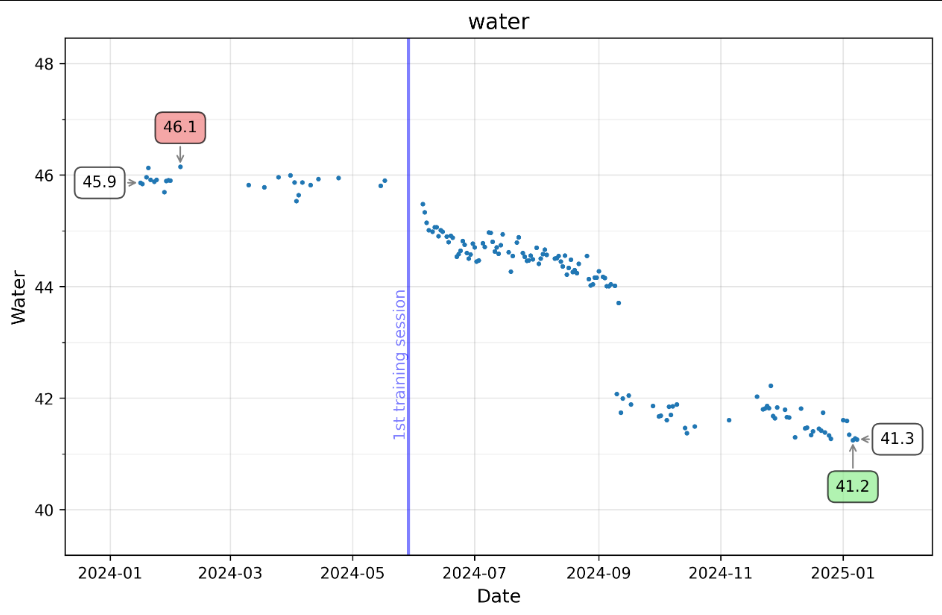

# The script to visualise data from xiaomi scales (mifit app / zepp life app)
## How to get the data:  
`open app` → `profile` → `settings` → `personal inf … privacy` → `Exercising user rights` → `Export data`  
  
  
## how to prepare env  

```
poetry install
```
or  
```
pip install pandas matplotlib ipykernel seaborn
```  
  
# example
